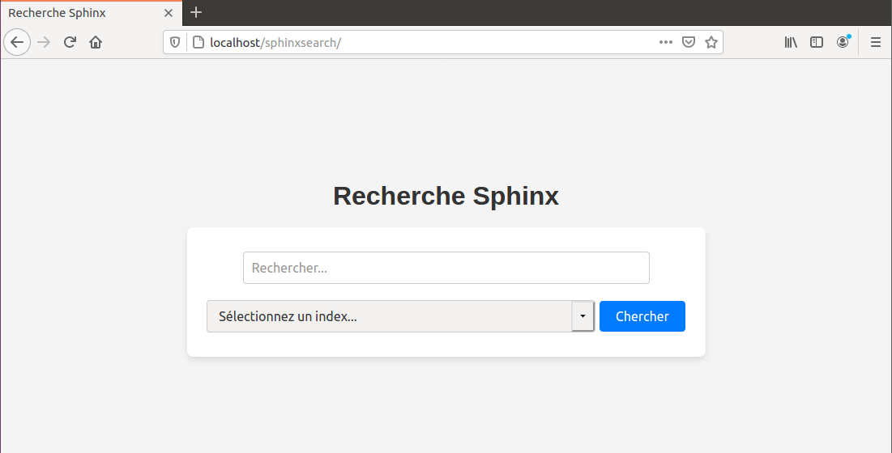

### Moteur de Recherche Sphinx
Un projet de moteur de recherche performant basé sur Sphinx, conçu pour traiter efficacement des données volumineuses tout en offrant une expérience utilisateur rapide et intuitive.

🚀 Détails du projet
Ce projet repose sur une architecture optimisée pour garantir la précision et la rapidité des résultats, même avec des volumes de données importants.

📌 Conception et mise en œuvre
- Développement d'un moteur de recherche basé sur Sphinx pour gérer des volumes massifs de données.
- Mise en place d'une solution évolutive, adaptée aux environnements professionnels variés.
  
⚡ Optimisation des performances
Indexation avancée : Structuration efficace des données pour améliorer la vitesse d'exécution des recherches.
Traitement des requêtes : Utilisation de SphinxQL pour formuler et exécuter des requêtes rapides et pertinentes.

🔧 Intégration technique
Backend : Utilisation de PHP pour la gestion des requêtes et l'interfaçage avec MySQL.
Frontend : Développement d'une interface utilisateur intuitive avec HTML et CSS.
Serveur : Configuration d'Apache2 pour l'hébergement et la gestion du système.

🌟 Impact et bénéfices
Amélioration des performances : Recherche rapide et précise, même pour des bases de données volumineuses.
Solution évolutive : Conçue pour s'adapter à divers besoins professionnels.

#### Fonctionnalités clés
- Architecture optimisée : Gestion de gros volumes de données grâce à Sphinx.
- Indexation efficace : Optimisation des structures de données pour des requêtes plus rapides.
- Résultats précis : Traitement avancé des requêtes avec SphinxQL.
- Interface intuitive : Conception d’un frontend ergonomique pour une navigation fluide.

### Technologies utilisées
Backend : PHP, MySQL
Frontend : HTML, CSS
Serveur : Apache2
Système de recherche : Sphinx
#### Installation et utilisation
#### Pré-requis
- PHP 7.4 ou version ultérieure
- MySQL
- Sphinx installé et configuré
- Serveur Apache
#### Resultat d'affichage

